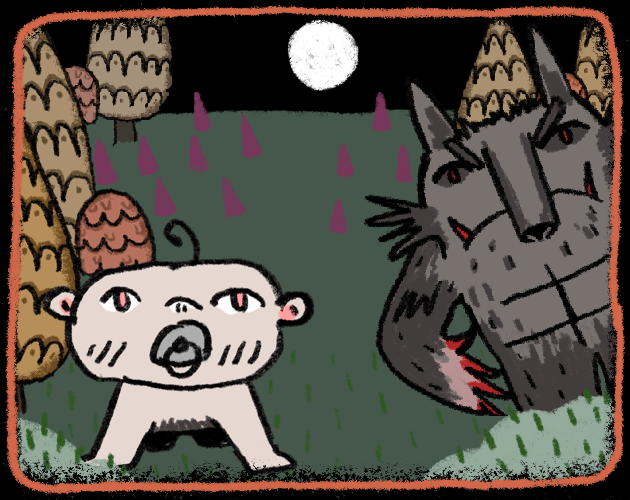
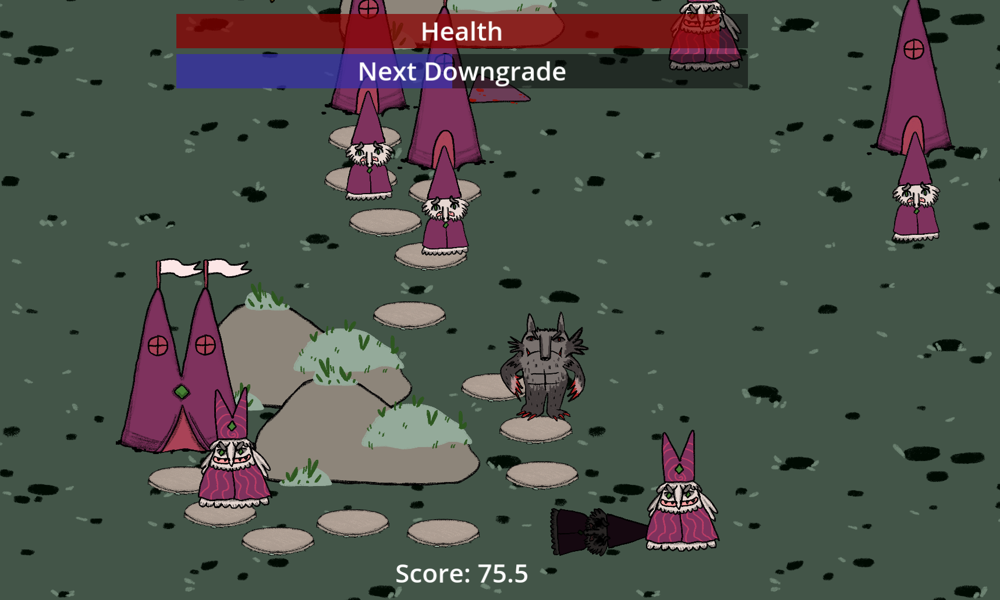
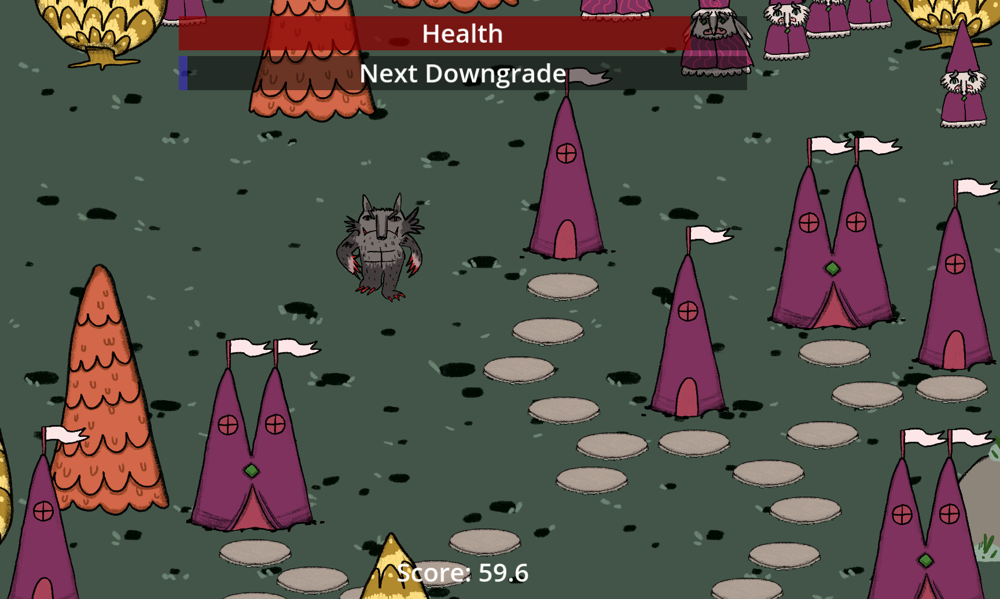
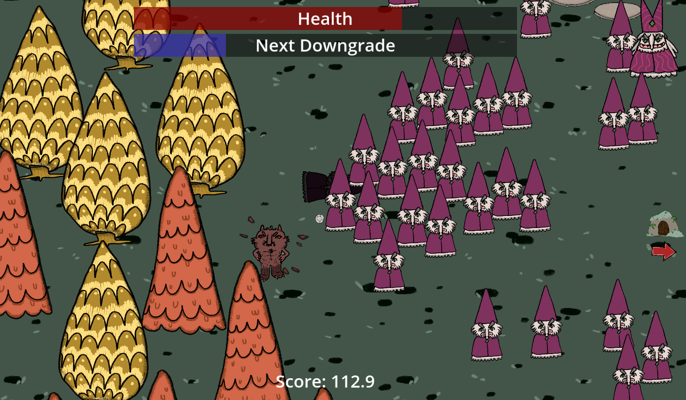
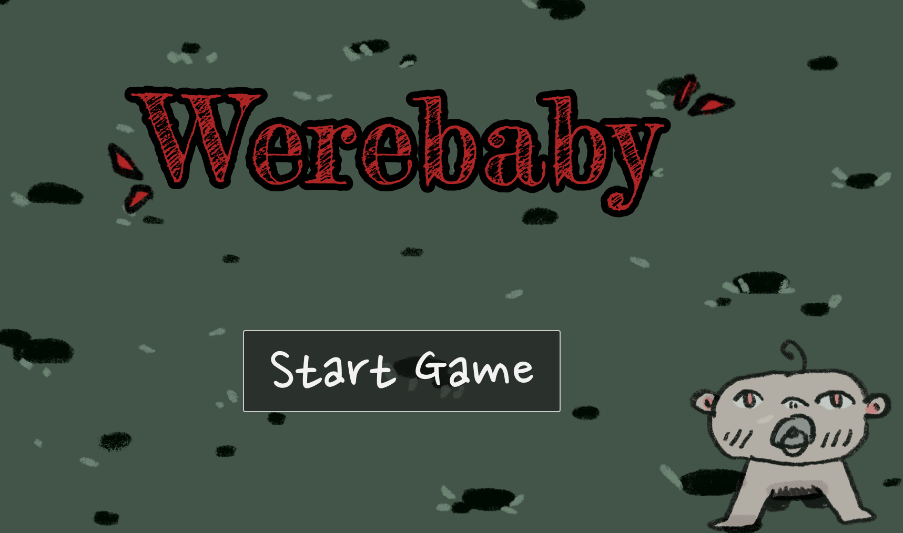
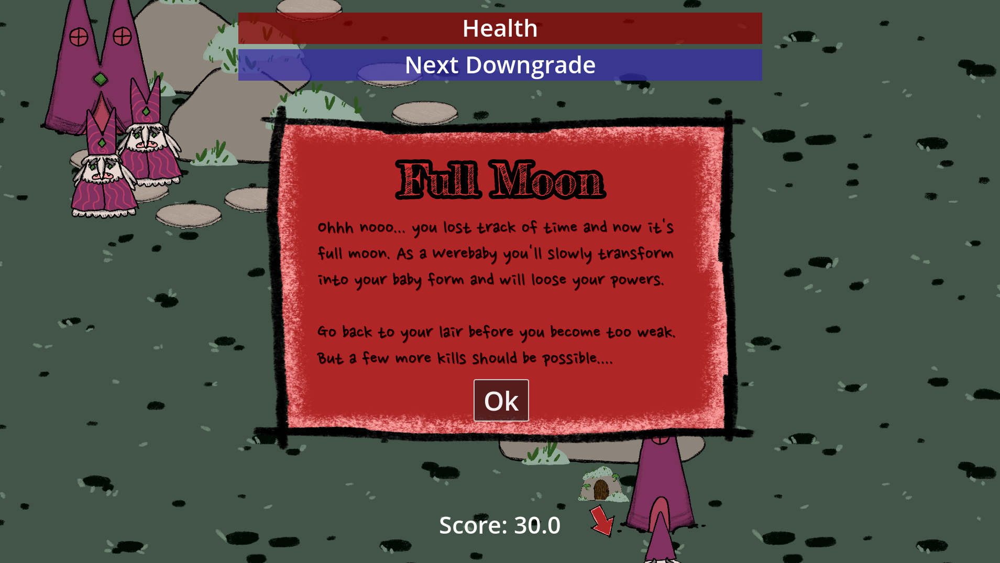

# Werebaby

We strongly recommend playing the windows version (see download below), the HTML Browser version unfortunately sometimes suffers from lags.

* [Download](https://github.com/TheJP/GMTKGameJam2023/releases/)
* [Web Version](https://orng-studio.itch.io/werebaby)

You are the mighty WEREBABY! Most days, you're a strong, scary monster with a single goal in mind: Make the life of the villagers hell. Maim them, eat them and destroy their houses.

However, once a full moon arrives, you'll begin transforming into your baby form, thereby slowly losing your powers. Try to terrorize the villagers for as long as possible, but make sure to get back into your lair before they kill you. If you die, your score doesn't count.

## Goal

Survive for as long as possible, then get back into your lair without dying.

## How to play

* move with WASD
* automatically attack all enemies and houses in range with your claws
* automatically attack one nearby enemy or house with your bite
* eating corpses heals you

## Screenshots

